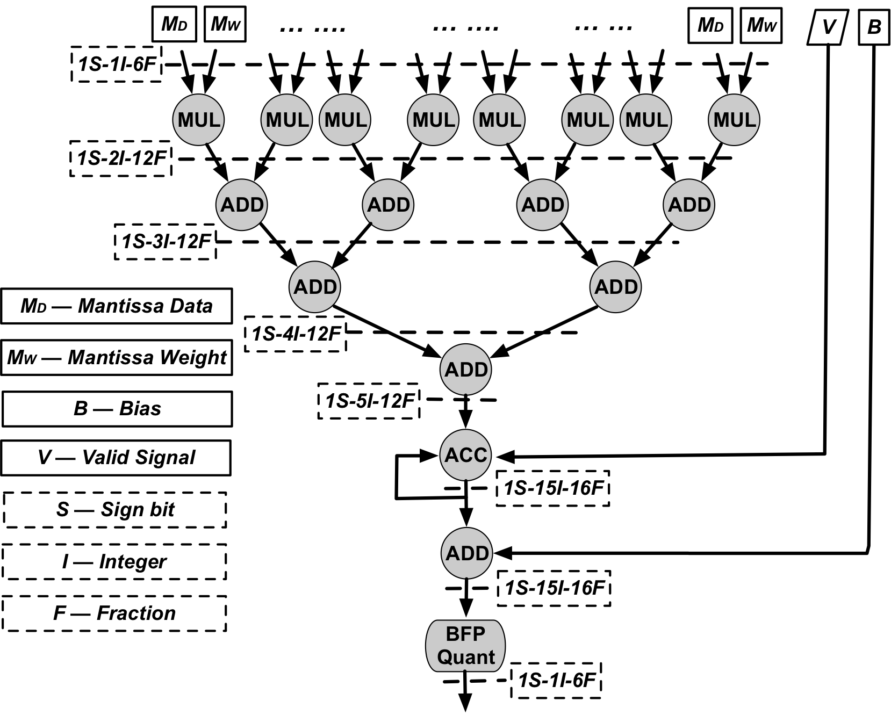
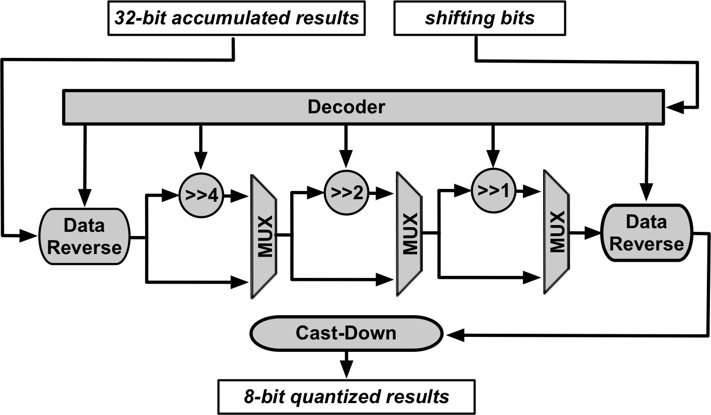
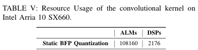

# Table of Content
<!-- TOC -->

- [Table of Content](#table-of-content)
- [1. Static_BFP_HW](#1-static_bfp_hw)
- [2. Hardware Hierarchy](#2-hardware-hierarchy)
- [3. Hardware Architecture](#3-hardware-architecture)
- [4. Resources Consumption](#4-resources-consumption)

<!-- /TOC -->

# 1. Static_BFP_HW
This repository contains the hardware implementation for Static BFP convolution on FPGA. The design is based on Verilog HDL.
For the detail, pls refer to the paper.
For the software tool support static BFP quantization, pls refer to the github repository.

# 2. Hardware Hierarchy

The hardware hierarchy is represented as follows:
```
verilog
+-- bfp_krnl
|   +-- bfp_compute_engine
|       +-- bfp_process_elemnt
|           +-- adder
|           +-- multiplier
|       +-- barrel_shifter
|           +-- mux
```
Note that the IPs of adder and multiplier are not included in this repository.
Pls generate by EDA tool by yourself.

# 3. Hardware Architecture

The overall hardware architecture of the Static BFP convolutional kernel is shown as follows, and the verilog implementation is [here](verilog/bfp_krnl.v):
<div style="text-align:center"></div>
<!--  -->


The hardware architecture of static BFP quantizer is shown in below, the verilog implementation is [here](verilog/barrel_shifter.v):
<div style="text-align:center"></div>
<!--  -->

# 4. Resources Consumption

The resource consumption of static BFP-based kernel is shown as belows:

<div style="text-align:center"></div>


